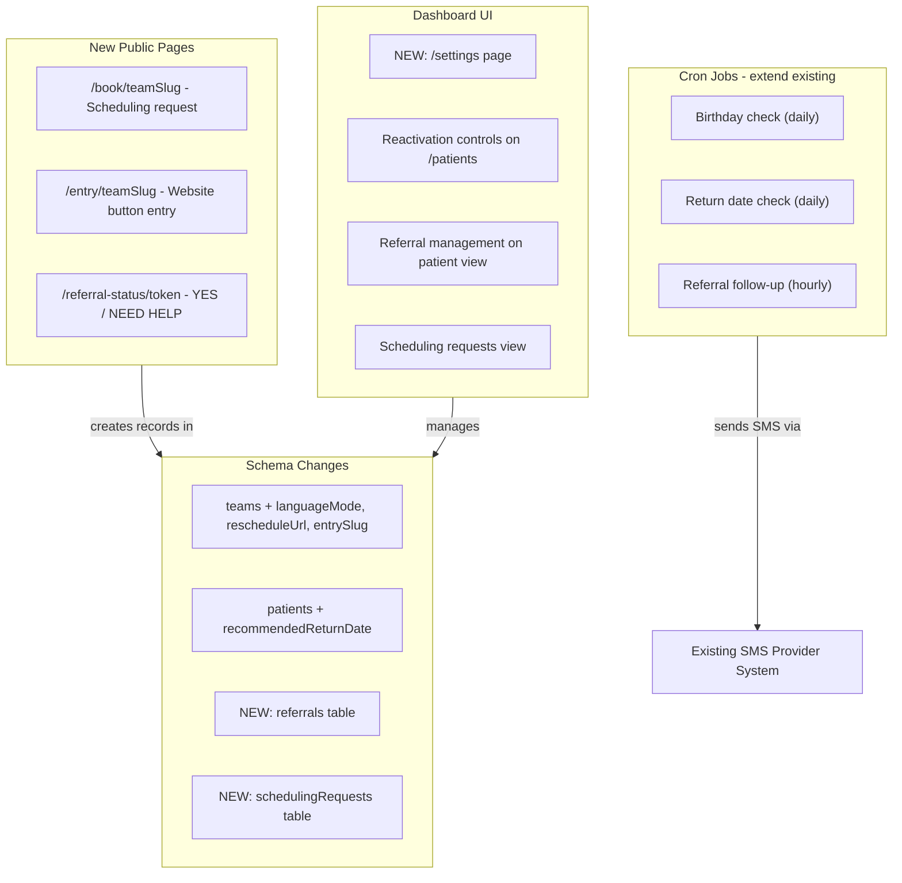
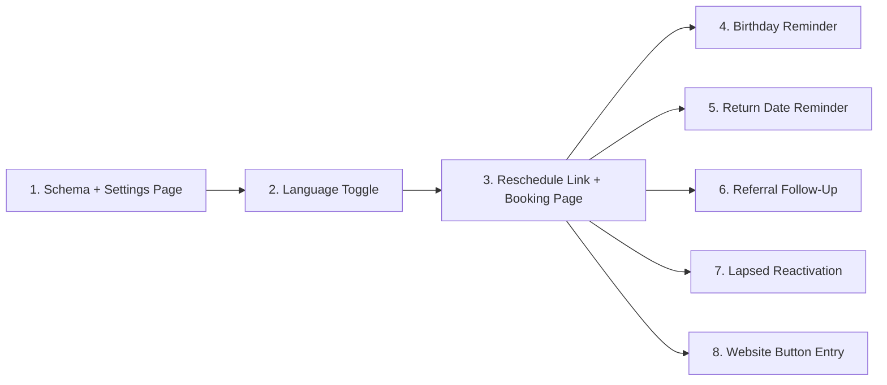

# SMOVR Pro Features - Execution Plan

## Current State

The app is a Next.js 14 + Convex healthcare dashboard with:

- Multi-tenant teams, patient management, appointment scheduling
- SMS via Twilio/GHL/Mock (per-team config) with 2-way messaging
- Automated 24h/1h appointment reminders (cron every minute)
- Patient landing pages (`/15-late`, `/30-late`, `/reschedule-cancel`)
- Existing `birthday` field on patients (unused)
- All current messages are hardcoded bilingual EN/ES

Key files: [convex/schema.ts](convex/schema.ts), [convex/webhook_utils.ts](convex/webhook_utils.ts), [convex/crons.ts](convex/crons.ts), [convex/reminders.ts](convex/reminders.ts), [convex/reminder_logic.ts](convex/reminder_logic.ts)

---

## Architecture Overview




---

## Feature 1: Team Settings Page (Foundation)

No settings UI exists today. Language toggle, reschedule URL, and website entry slug all need a place to live.

**Schema changes** in [convex/schema.ts](convex/schema.ts) - `teams` table:

- `languageMode: v.optional(v.union(v.literal("en"), v.literal("en_es")))` -- default `"en_es"` (preserves current bilingual behavior)
- `rescheduleUrl: v.optional(v.string())` -- custom scheduling URL override
- `entrySlug: v.optional(v.string())` -- unique slug for website button entry URL

**Backend**: New `convex/teamSettings.ts` with mutations to update team settings, query to read them.

**UI**: New `/settings` page accessible from header nav. Sections:

- General: team name, timezone, address, contact phone
- Messaging: language mode toggle (English only / English + Spanish)
- Scheduling: reschedule URL (with preview of what patients will see)
- Website Entry: auto-generated entry URL with copy button

**Exit criteria**:

- Staff can access settings page from dashboard nav
- All team-level config fields are editable and persist
- Language mode, reschedule URL, and entry slug save correctly
- Settings are scoped to the authenticated user's team

---

## Feature 2: Language Toggle

**Scope**: Refactor all message formatting to respect `team.languageMode`.

**Changes to** [convex/webhook_utils.ts](convex/webhook_utils.ts):

- Refactor `formatScheduleMessage`, `formatCancelMessage`, `formatReminder24hMessage`, `formatReminder1hMessage` to accept a `languageMode` parameter
- When `languageMode === "en"`, output English only; when `"en_es"`, output bilingual (current behavior)
- All new Pro feature message formatters also accept `languageMode`

**Changes to** [convex/reminders.ts](convex/reminders.ts):

- Load team's `languageMode` when formatting reminder messages
- Pass it through to formatters

**Changes to** [src/lib/webhook-utils.ts](src/lib/webhook-utils.ts):

- Same refactor for `sendScheduleWebhook` / `sendCancelWebhook` callers

**Exit criteria**:

- When team is set to "English only," all automated messages are English only
- When set to "English + Spanish," messages are bilingual (current behavior)
- Existing appointment confirmation, cancellation, 24h, and 1h reminders all respect the toggle
- All new Pro feature messages respect the toggle

---

## Feature 3: Configurable Reschedule Link + Patient Booking Page

**Two parts**: (a) a SMOVR-hosted scheduling request page, (b) the ability to override the link per team.

### 3a. Scheduling Request Page

**New schema** - `schedulingRequests` table:

```
patientId: Id<"patients">
teamId: Id<"teams">
source: "booking_page" | "website_button" | "reactivation"
status: "pending" | "scheduled" | "dismissed"
patientName: optional string
patientPhone: string
notes: optional string
createdAt: string
resolvedAt: optional string
```

**New public page**: `/book/[teamSlug]`

- No auth required (patient-facing)
- Form: name, phone number, optional preferred date/notes
- On submit: creates/updates patient, creates scheduling request, sends confirmation SMS
- Bilingual form labels based on team's language mode

**Dashboard**: Add "Requests" badge/section (could be a tab on `/appointments` or a standalone page) showing pending scheduling requests. Staff can convert to appointment or dismiss.

### 3b. Configurable URL

- If `team.rescheduleUrl` is set, all `{{link}}` placeholders in messages resolve to that URL
- If not set, default to `/book/[teamSlug]` (the SMOVR booking page)
- Update all message formatters that include scheduling links

**Exit criteria**:

- Patient-facing booking page works at `/book/[teamSlug]`
- Submitting the form creates a scheduling request visible in the dashboard
- Staff can resolve (schedule or dismiss) requests
- When `rescheduleUrl` is configured in settings, message links use that URL instead
- Links in all automated messages (reminders, reactivation, return-date) use the correct URL

---

## Feature 4: Birthday Reminder

**Existing foundation**: `patients.birthday` field exists (ISO date `YYYY-MM-DD`), `reminders` table supports `reminderType: "birthday"` with optional `appointmentId`.

**Backend** - new function in [convex/reminders.ts](convex/reminders.ts) (or a new `convex/proReminders.ts`):

- `checkAndSendBirthdayReminders`: queries all patients with a `birthday` matching today's date (MM-DD comparison in team timezone)
- For each match, check `reminders` table for existing `birthday` reminder for this year
- If not sent yet, send birthday message and record in `reminders`
- Respect quiet hours

**Cron** - add to [convex/crons.ts](convex/crons.ts):

- Daily cron (e.g., 9:00 AM) calling `checkAndSendBirthdayReminders`

**Message formatter**: `formatBirthdayMessage(patientName, languageMode)`

- EN: "Hello {{name}}, happy birthday from everyone at our office. We wish you a great day."
- ES: "Hola {{name}}, feliz cumpleaños de parte de todos en nuestra oficina. Le deseamos un gran dia."

**Exit criteria**:

- Patients with a birthday matching today's date receive an automated SMS
- Message is sent once per year per patient (idempotent via `reminders` table)
- Message respects language mode
- No message sent if birthday field is empty

---

## Feature 5: Future Appointment Reminder

**Schema change** - `patients` table:

- Add `recommendedReturnDate: v.optional(v.string())` (ISO date `YYYY-MM-DD`)

**UI** - on the patient edit form/view:

- New date picker field for "Recommended Return Date"
- Clear button to remove the date

**Backend** - new cron function:

- `checkAndSendReturnDateReminders`: runs daily
- For each patient with a `recommendedReturnDate`:
  - 30 days before: send first reminder (check `reminders` table for `"return_30d"`)
  - 7 days before: check if patient has any scheduled appointment on/after the recommended return date; if no appointment found, send second reminder (`"return_7d"`)
- Message includes the scheduling link (configurable or default `/book/[teamSlug]`)

**Message formatter**: `formatReturnDateMessage(patientName, link, languageMode)`

- EN: "Hello {{name}}, it may be time to schedule your next visit. Please click the link to book an appointment: {{link}}"
- ES: "Hola {{name}}, puede ser momento de programar su proxima visita. Por favor haga clic en el enlace para reservar una cita: {{link}}"

**Cron** - add to [convex/crons.ts](convex/crons.ts):

- Daily cron calling `checkAndSendReturnDateReminders`

**Exit criteria**:

- Staff can set a recommended return date on any patient record
- 30 days before the date, patient receives an SMS with a scheduling link
- 7 days before, a second SMS is sent only if no future appointment exists
- Both reminders are idempotent (won't double-send)
- Messages respect language mode and configurable reschedule URL
- Quiet hours respected

---

## Feature 6: Referral Follow-Up

**New schema** - `referrals` table:

```
patientId: Id<"patients">
teamId: Id<"teams">
referralName: optional string
referralAddress: optional string
referralPhone: optional string
notes: optional string
status: "pending" | "confirmed" | "needs_help"
statusUpdatedAt: optional string
followUpSentAt: optional string
followUpDelay: optional number (minutes before follow-up is sent; default 0 = immediate)
token: string (unique token for landing page URL)
createdAt: string
```

**UI** - Referral management:

- Add referral section to patient detail view (or a tab)
- "Add Referral" form: referral name, address, phone, notes, follow-up delay
- List of referrals with status badges (pending / confirmed / needs help)
- Timestamp of status changes

**Backend**:

- On referral creation: if `followUpDelay === 0`, send follow-up SMS immediately; otherwise schedule via cron
- Cron job (hourly or every few minutes): check for referrals past their follow-up delay that haven't been sent yet
- Generate unique token for each referral (for landing page URL)

**New public landing page**: `/referral-status/[token]`

- No auth required
- Shows two buttons: "YES, I scheduled the appointment" / "NEED HELP, I still need help scheduling"
- On click: updates referral status + timestamp, shows confirmation screen
- Bilingual UI based on team language mode

**Message formatter**: `formatReferralFollowUpMessage(patientName, link, languageMode)`

- EN: "Hi {{name}}, just checking in about the appointment we discussed. Please click the link below to let us know your status: {{link}}"
- ES: "Hola {{name}}, solo queriamos verificar sobre la cita que comentamos. Por favor haga clic en el enlace para indicarnos su estado: {{link}}"

**Exit criteria**:

- Staff can create referrals from the patient detail view
- Follow-up SMS is sent after creation (or after configured delay)
- SMS contains a link to the referral status landing page
- Patient can click YES or NEED HELP on the landing page
- Dashboard shows referral status with timestamps
- Status updates are logged
- Messages respect language mode

---

## Feature 7: Lapsed Patient Reactivation

**UI** - on the `/patients` page:

- Add checkbox/toggle next to each patient name
- "Send Reactivation Message" action button (appears when patients are selected)
- Confirmation dialog showing count of selected patients
- Option for bulk select / select all filtered results

**Backend**:

- Mutation to send reactivation message to one or more patients
- Records each sent message in the `messages` table (outbound, with template reference)
- Uses team SMS config for sending

**Message formatter**: `formatReactivationMessage(patientName, link, languageMode)`

- EN: "Hi {{name}}, we have not seen you in a while and just wanted to check in. If you would like to schedule a visit, you can do that here: {{link}}"
- ES: "Hola {{name}}, hace tiempo que no lo vemos y queriamos saludar. Si desea programar una visita puede hacerlo aqui: {{link}}"

**Exit criteria**:

- Staff can select one or more patients from the patient list
- Clicking "Send Reactivation Message" sends the message to all selected patients
- Messages appear in each patient's conversation history
- Messages respect language mode and configurable reschedule URL
- Confirmation dialog prevents accidental bulk sends

---

## Feature 8: Website Button Entry

**New public page**: `/entry/[teamSlug]`

- No auth required (visitor-facing)
- Simple form: name, phone number
- On submit:
  1. Create or update patient in SMOVR (match by phone)
  2. Create a scheduling request with `source: "website_button"`
  3. Send first SMS: "Hello {{name}}, thanks for reaching out. How can we help you today?"
  4. Log the event with timestamp
  5. Show confirmation: "Thanks! You'll receive a text shortly."

**Backend**: New HTTP action or API route to handle the form submission.

**Dashboard visibility**:

- Website-originated contacts appear in the scheduling requests view with source = "website_button"
- The SMS conversation is visible in `/messages`
- Staff can respond via the existing messaging UI

**Settings integration**:

- Team settings page shows the entry URL (e.g., `https://app.smovr.com/entry/[teamSlug]`)
- Copy button for easy sharing with the clinic's web developer

**Exit criteria**:

- Clinic can place the SMOVR URL behind any button on their website
- Visitor clicking the button is taken to a SMOVR page to enter name + phone
- SMOVR creates/updates the contact and sends first SMS
- Event is visible in the dashboard (scheduling requests + messages)
- Entry URL is displayed in team settings with copy functionality

---

## Schema Migration Summary

Changes to existing tables:

- `teams`: add `languageMode`, `rescheduleUrl`, `entrySlug`
- `patients`: add `recommendedReturnDate`
- `logs`: make `appointmentId` optional (to support non-appointment logs)

New tables:

- `referrals` (with indexes on `teamId`, `patientId`, `token`, `status`)
- `schedulingRequests` (with indexes on `teamId`, `status`)

---

## Recommended Build Order

Even though this is one release, the dependencies suggest this build sequence:




1. **Schema changes + Settings page** -- foundation for everything
2. **Language toggle** -- refactor existing messages first, pattern reused by all new features
3. **Configurable reschedule link + booking page** -- scheduling link used by features 4-8
4. **Birthday reminder** -- simplest cron feature, validates the pattern
5. **Future appointment reminder** -- builds on birthday pattern + adds appointment checking
6. **Referral follow-up** -- most complex (new table, landing page, delayed triggers)
7. **Lapsed patient reactivation** -- straightforward UI + send
8. **Website button entry** -- new public page + contact creation flow

